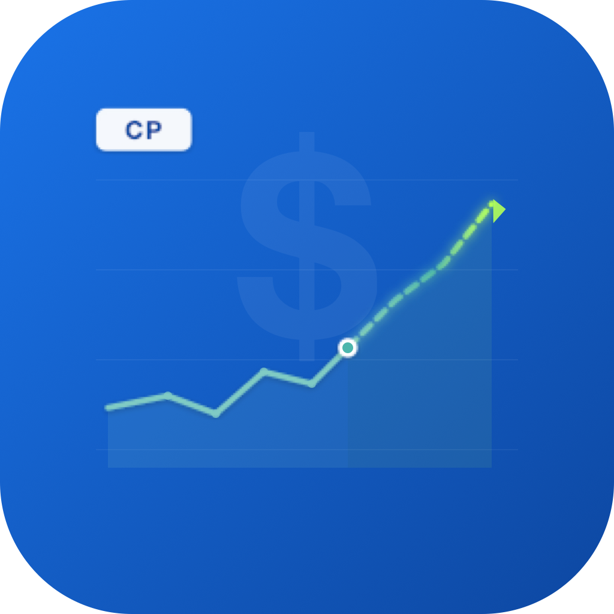
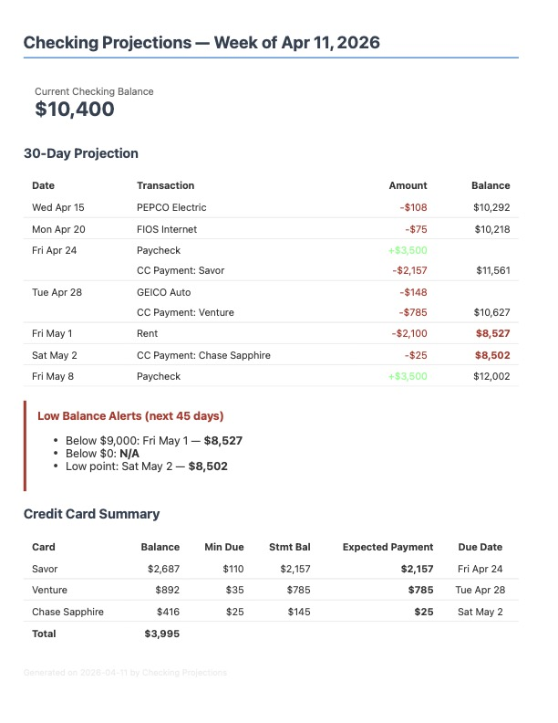
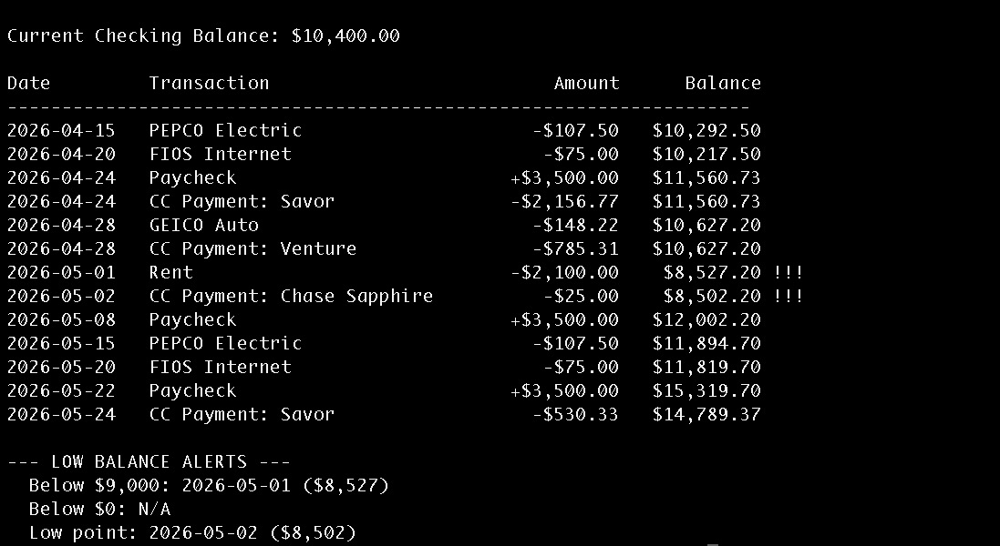
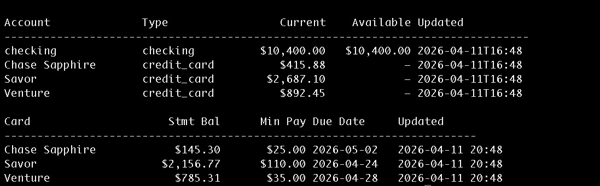

<p align="center">
  
</p>

<h1 align="center">Checking Projections</h1>

<p align="center">
  <em>Know where your checking account is headed — before it gets there.</em>
</p>

<p align="center">
  
  
  
</p>

---

Checking Projections is a small self-hosted tool that pulls your checking account and credit cards from [Plaid](https://plaid.com/), walks a day-by-day simulation of your balance forward using the recurring bills and paychecks you define, and emails you a weekly digest with the next month laid out — including a loud warning if it looks like you're headed below your comfort threshold (or, worse, below zero).

I built it because I got tired of doing mental math every time a big bill was coming up, especially with my intent to pay full credit card statement balances each month, whereas those balances (and payments) can vary significantly month-to-month. I wanted something that would just tell me, every Saturday morning: *here's what the next 30 days look like, and here's the day the balance gets scary.* If that sounds useful to you too, read on.

## What it does

- **Pulls real data from Plaid.** Checking balance and transactions from your bank, statement balances and due dates from your credit cards.
- **Projects your balance forward.** Given your recurring paychecks and bills (defined in a YAML file), it simulates every day of the next 30+ days so you can see exactly when things land.
- **Auto-generates credit-card payments.** Pick a payment strategy per card (`statement_balance`, `min_payment`, or `current_balance`) and it will add the right payment event on the right due date — and keep it honest as subsequent payments draw down the balance.
- **Matches recurring bills against reality.** When a real transaction posts that looks like your rent, your paycheck, or your electric bill, it marks that cycle as "fulfilled" and removes it from the projection so you don't double-count.
- **Emails you a weekly digest.** HTML email every Saturday morning with a current balance, 30-day detail table, low-balance alerts, and a credit-card summary sorted by due date.
- **Runs anywhere Docker runs.** One container, one SQLite file, one config file. No cloud account required.

## Screenshots

**Weekly email digest:**



**`projection` CLI output:**



**`balances` CLI output:**



## How it works

```
   ┌─────────┐      ┌──────────┐      ┌──────────┐      ┌──────────────┐      ┌─────────┐
   │  Plaid  │─────▶│   sync   │─────▶│  SQLite  │─────▶│  projection  │─────▶│  digest │
   │  (bank) │      │  (pull)  │      │ (./data) │      │    engine    │      │ (email) │
   └─────────┘      └──────────┘      └──────────┘      └──────────────┘      └─────────┘
                          │                                    ▲
                          ▼                                    │
                    ┌────────────┐                      ┌──────────────┐
                    │  matcher   │                      │recurring.yaml│
                    │ (reconcile │                      │ (your bills) │
                    │   posted)  │                      └──────────────┘
                    └────────────┘
```

The **sync** job hits Plaid's `/transactions/sync`, `/accounts/get`, and `/liabilities/get` endpoints and stashes everything in SQLite. The **matcher** then walks recent unmatched transactions and tries to pair each one with a recurring definition — by substring name match, amount within tolerance, and date within tolerance of the expected cycle. Anything matched is marked "fulfilled" for that cycle.

The **projection engine** starts from your current available balance and walks forward day by day, adding every unfulfilled recurring event, every auto-generated credit card payment, and every pending Plaid transaction. The output is a list of `ProjectedDay` records — opening balance, transactions that hit, closing balance — which the CLI prints and the **digest** renders into HTML.

The whole thing runs in a single container on a cron schedule you control from `config.yaml`.

## Prerequisites

- A **Plaid developer account.** The free [sandbox](https://dashboard.plaid.com/signup) tier is enough to try everything out end-to-end with fake data. For real accounts you'll need development or production access.
- **Docker + Docker Compose.** This is the easy path. You *can* run it as a plain Python app — see [Local development](#local-development) — but Docker is what the docs assume.
- **SMTP credentials** for wherever you want the digest emailed from. Gmail app passwords work great; so does any transactional email provider.
- **Python 3.13** if you want to run the test suite or hack on the code locally.

## Setup

### Quick start

```bash
git clone https://github.com/jchaps/checking_projections.git
cd checking_projections
./setup.sh
```

`setup.sh` handles everything: it creates scaffold files, builds the Docker image, and launches a browser-based setup wizard that walks you through:

1. **Plaid credentials** — enter your `client_id` and `secret` (stored in `.env`, never in config files).
2. **Link bank accounts** — connect each institution through Plaid Link. Link all institutions before proceeding.
3. **Select checking account** — pick your primary checking account from linked accounts.
4. **Select credit cards** — choose which cards to track and set a payment strategy per card (`statement_balance`, `min_payment`, or `current_balance`).
5. **Email settings** — configure SMTP for digest emails, with a test button.
6. **Schedule & thresholds** — set sync/digest schedules and low-balance warning threshold.
7. **Recurring transactions** — define bills and income, with suggestions based on recent transaction history.

When you click **Finish & Close**, the wizard writes `config.yaml`, `recurring.yaml`, and `.env`, initializes the database, and the script automatically starts the application with `docker compose up -d`.

To re-run the wizard later (e.g. to add a new institution or credit card), just run `./setup.sh` again — it will stop the running application, open the wizard pre-populated with your existing configuration, and restart the application when you're done.

### Manual setup

If you prefer to configure everything by hand, you can edit the YAML files directly:

```bash
cp config.yaml.example config.yaml
cp recurring.yaml.example recurring.yaml
```

Open `config.yaml` and fill in:

- **`plaid.environment`** — `sandbox`, `development`, or `production`.
- **`accounts.checking`** — which Plaid item your checking account lives under, and a substring that matches the Plaid account name. If you have more than one checking account on the same login, add `account_mask: "1234"` to disambiguate by the last four digits.
- **`accounts.credit_cards`** — one entry per card, each pointing at a Plaid item. Multiple cards under one login share a `plaid_item`. Pick a `payment_strategy` per card.
- **`smtp`** — host, port, username, password, from/to. For Gmail: `smtp.gmail.com`, port `465`, and an [app password](https://myaccount.google.com/apppasswords).
- **`thresholds.low_balance_warning`** — the dollar amount below which you want the digest to light up red.
- **`schedule`** — when the sync and digest jobs run. Times are in the container's timezone (set to `America/New_York` by default in `docker-compose.yml`).

Create a `.env` file with your Plaid credentials:

```bash
PLAID_CLIENT_ID=your_client_id
PLAID_SECRET=your_secret
PLAID_ENCRYPTION_KEY=your_generated_key
```

Generate the encryption key with `docker compose run --rm checking-projections generate-key`.

Then open `recurring.yaml` and describe your recurring paychecks and bills. Frequencies supported:

| Frequency       | Required fields                 | Example                    |
|-----------------|---------------------------------|----------------------------|
| `monthly`       | `day`                           | Rent on the 1st            |
| `biweekly`      | `anchor_date` (a known cycle)   | Paycheck every other Friday|
| `twice_monthly` | `days: [1, 15]`                 | Gym on the 1st and 15th    |
| `quarterly`     | `day`, `anchor_month` (1–12)    | Water bill Feb/May/Aug/Nov |

Each entry needs a `match` block — a substring that appears in the Plaid transaction name, an amount tolerance, and an optional date tolerance — so the matcher can reconcile projected events against posted transactions. If a bill varies month to month, use `amount_range: [low, high]` instead of a fixed `amount` and the projection will use the midpoint.

> **Credit card payments are not listed in `recurring.yaml`.** They're generated automatically from the cards you defined in `config.yaml`.

Link your accounts, sync, and start:

```bash
docker compose run --rm -p 8484:8484 checking-projections link capital_one
docker compose run --rm checking-projections sync
docker compose up -d
```

## Ongoing use

Most of the time, you shouldn't have to touch anything — the scheduler syncs and emails on its own. But when you want to peek at the state of things, these commands are your friends. All of them run against the live database.

| Command              | What it does                                                             |
|----------------------|--------------------------------------------------------------------------|
| `sync`               | Pull fresh data from Plaid right now.                                    |
| `projection --days N`| Print the day-by-day projection for the next N days (default 30).        |
| `digest`             | Build and send the email digest immediately.                             |
| `balances`           | Show current balances and credit card statement info.                    |
| `recurring`          | Show each recurring definition and whether its latest cycle was matched. |
| `list-accounts`      | List every account under every linked Plaid item.                        |

Invoke them the same way as setup:

```bash
docker compose run --rm checking-projections projection --days 45
docker compose run --rm checking-projections balances
```

Logs from the scheduler live in `docker compose logs -f checking-projections`.

### Editing bills and cards

The easiest way to make changes is to re-run the setup wizard:

```bash
./setup.sh
```

It will load your existing configuration, let you add new institutions, credit cards, or recurring transactions, and restart the application when you're done.

You can also edit `config.yaml` and `recurring.yaml` directly — changes are picked up on the next sync or projection run, no rebuild required.

## Configuration reference

<details>
<summary><strong>config.yaml</strong> — click to expand</summary>

| Key | Type | Description |
|---|---|---|
| `plaid.environment` | enum | `sandbox`, `development`, or `production` |
| `accounts.checking.plaid_item` | string | Which item alias your checking lives under |
| `accounts.checking.account_name` | string | Substring to match against Plaid's account name |
| `accounts.checking.account_mask` | string | *(Optional)* Last 4 digits, to disambiguate duplicates |
| `accounts.credit_cards[].name` | string | Display name used throughout the tool |
| `accounts.credit_cards[].plaid_item` | string | Which item alias this card lives under |
| `accounts.credit_cards[].account_name` | string | Substring to match against Plaid's account name |
| `accounts.credit_cards[].payment_strategy` | enum | `statement_balance`, `min_payment`, or `current_balance` |
| `smtp.{host,port,username,password,from,to}` | — | SMTP connection and envelope |
| `thresholds.low_balance_warning` | number | Dollar threshold for the digest's red alert |
| `schedule.sync.{days,hour,minute}` | cron-ish | When to run sync (e.g. `mon,wed,sat` at `10:00`) |
| `schedule.digest.{days,hour,minute}` | cron-ish | When to run the digest |
| `digest.projection_days_detail` | int | How many days of transaction detail to include in the email |
| `digest.projection_days_lowpoint` | int | How far ahead to scan for low-balance alerts |
| `data_dir` | path | Where SQLite and tokens live (`/app/data` in Docker) |

</details>

<details>
<summary><strong>recurring.yaml</strong> — click to expand</summary>

Each entry under `transactions:` needs:

- `name` — display name
- `type` — `credit` (money in) or `debit` (money out)
- `amount` **or** `amount_range: [low, high]` — fixed amount, or range whose midpoint is used for projection
- `frequency` — `monthly`, `biweekly`, `twice_monthly`, or `quarterly`
- Frequency-specific fields (see table above)
- `match.name_contains` — substring to match against Plaid transaction names (case-insensitive)
- `match.amount_tolerance` — dollars of wiggle room when matching
- `match.date_tolerance_days` — days of wiggle room (default 3)

</details>

## Data and security

- **Everything stays local.** The SQLite database lives in `./data/checking.db`. Plaid access tokens live in `./secrets/plaid_tokens.json` and are encrypted at rest with the Fernet key in your `.env`. Plaid credentials (`PLAID_CLIENT_ID`, `PLAID_SECRET`) are stored in `.env`, not in config files.
- **`.gitignore` already excludes** `data/`, `secrets/`, `config.yaml`, `recurring.yaml`, and `.env` so you can't accidentally commit them. Double-check before pushing to a fork anyway.
- **No persistent web UI.** The setup wizard runs only during configuration and shuts down when you're done. Only Plaid and your SMTP provider see your data.
- **The digest email contains your balance and upcoming transactions.** Think about whether that's something you want sitting in your inbox and pick a destination accordingly.

## Local development

You don't have to use Docker. If you'd rather run it as a plain Python app:

```bash
python3.13 -m venv .venv
source .venv/bin/activate
pip install -r requirements.txt

cp config.yaml.example config.yaml
cp recurring.yaml.example recurring.yaml
# …edit both…

python -m app.main setup-db
python -m app.main sandbox-link capital_one ins_128026
python -m app.main sync
python -m app.main projection --days 30
```

Run the tests:

```bash
pytest
```

### Project layout

```
app/
  main.py           # CLI entrypoint (argparse)
  scheduler.py      # APScheduler cron jobs
  sync.py           # Pulls from Plaid, writes to SQLite
  plaid_client.py   # Plaid API wrapper + encrypted token storage
  link_server.py    # Local HTTP server for the Plaid Link flow
  setup_server.py   # Browser-based setup wizard (Flask)
  static/setup.html # Setup wizard single-page UI
  db.py             # SQLite schema and helpers
  matcher.py        # Reconciles posted transactions against recurring defs
  projections.py    # Day-by-day balance simulation
  digest.py         # HTML email rendering and SMTP send
  config.py         # YAML loading and validation
tests/              # pytest suites for config, db, matcher, plaid_client, projections
```

## Troubleshooting

**"No access token for item 'xyz', skipping"** — you referenced `xyz` in `config.yaml` but never ran `link xyz`. Do that, or remove the reference.

**"Failed to decrypt token file"** — your `PLAID_ENCRYPTION_KEY` doesn't match the one used when tokens were saved. If you just generated a new key, run `encrypt-tokens` to migrate a plaintext file, or re-run `link` for each item.

**"SMTP authentication failed" (535)** — for Gmail, make sure you're using an [app password](https://myaccount.google.com/apppasswords), not your account password. Port `465` requires SSL; port `587` requires STARTTLS.

**The projection shows a bill twice.** The matcher didn't catch the real transaction — check that `match.name_contains` actually appears in the Plaid name (run `projection` after `sync` and look at the raw transaction list), and that `amount_tolerance` is wide enough.

**Wrong account picked up when two accounts share a name.** Add `account_mask: "1234"` (last four digits of the account number) to `accounts.checking` in `config.yaml`.

**Credit card payment amount looks wrong.** Check the card's `payment_strategy`. If you want to pay statement in full, use `statement_balance`. If Plaid doesn't return a statement balance for your card, the projection falls back to the current balance.

## License

[MIT](LICENSE). No warranty — if the projection is wrong and you overdraft, that's on you. Double-check the output, especially the first few weeks after you set it up.
